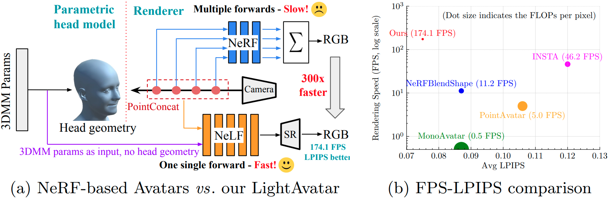

# LightAvatar: Efficient Head Avatar as Dynamic NeLF

This repository contains the major source code for our paper in [ECCV'24 CADL Workshop](https://sites.google.com/nvidia.com/cadl2024): 
> **LightAvatar: Efficient Head Avatar as Dynamic Neural Light Field** [[arxiv](https://arxiv.org/abs/2409.18057)] [[pdf](./paper/lightavatar-eccv24-workshop-updated.pdf)] \
> [Huan Wang](http://huanwang.tech/)<sup>1,2,†</sup>, [Feitong Tan](https://scholar.google.com/citations?user=qsrpuKIAAAAJ&hl=en)<sup>2</sup>, [Ziqian Bai](https://zqbai-jeremy.github.io/)<sup>2,3</sup>, [Yinda Zhang](https://www.zhangyinda.com/)<sup>2</sup>, [Shichen Liu](https://shichenliu.github.io/)<sup>2</sup>, [Qiangeng Xu](https://xharlie.github.io/)<sup>2</sup>, [Menglei Chai](https://mlchai.com/)<sup>2</sup>, [Anish Prabhu](https://scholar.google.com/citations?user=1zqcBjcAAAAJ&hl=en)<sup>2</sup>, [Rohit Pandey](https://www.linkedin.com/in/rohit-pandey-bab10b7a/), [Sean Fanello](https://www.seanfanello.it/)<sup>2</sup>, [Zeng Huang](https://zeng.science/)<sup>2</sup>, and [Yun Fu](http://www1.ece.neu.edu/~yunfu/)<sup>1</sup> \
> <sup>1</sup>Northeastern University, USA &nbsp; <sup>2</sup>Google, USA &nbsp; <sup>3</sup>Simon Fraser University, Canada \
> <sup>†</sup>Work done when [Huan](http://huanwang.tech/) was an intern at Google. \
> Corresponding author: Huan Wang, huan.wang.cool@gmail.com.

## TL'DR
<div align="center">
    <a></a>
    </br>
</div>
LightAvatar provides a proof-of-concept framework of employing <i>neural light field</i> (NeLF) to build photorealistic 3D head avatars. It takes 3DMM parameters and camera pose as input, and renders the RGB via a single network forward, no need for mesh as input. Thanks to the dedicatedly designed NeLF network, LightAvatar can render 512x512 images at <b>174 FPS</b> on a consumer-grade GPU (RTX3090) with stock deep learning framework.


## Code Content
The code is based on TensorFlow. Due to Google IP issues, we are not able to release the complete code. Here we release the key code modules (model architecture and loss function) for reference. Should you have any questions, welcome to raise an issue or contact Huan Wang (huan.wang.cool@gmail.com).


## Reference

If our work or code helps you, please consider to cite our paper. Thank you!
```BibTeX
@inproceedings{wang2024lightavatar,
  author = {Huan Wang and Feitong Tan and Ziqian Bai and Yinda Zhang and Shichen Liu and Qiangeng Xu and Menglei Chai and Anish Prabhu and Rohit Pandey and Sean Fanello and Zeng Huang and Yun Fu},
  title = {LightAvatar: Efficient Head Avatar as Dynamic Neural Light Field},
  booktitle = {ECCV Workshop},
  year = {2024}
}
```
